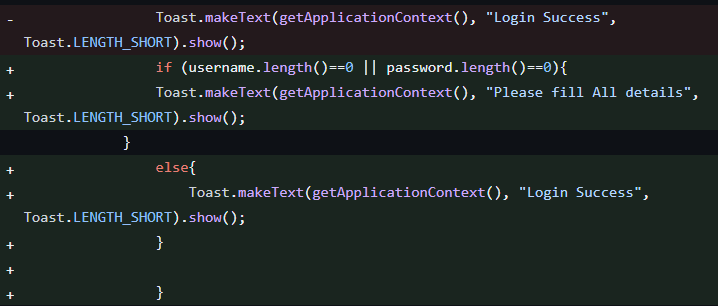
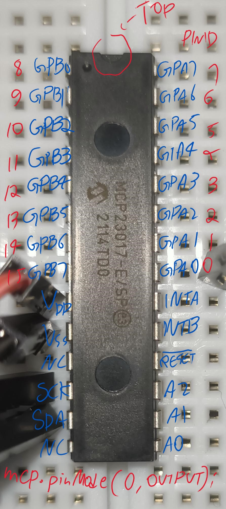
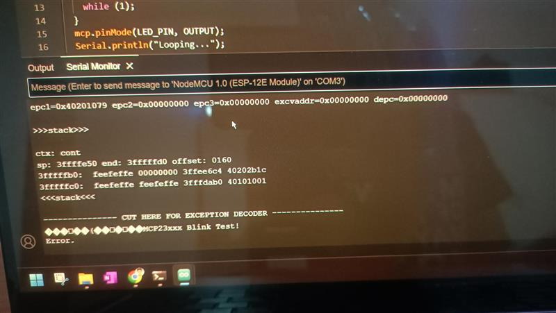

# Child_safety_gadget_HomeSecurity
Child safety gadget is a home security device which ensures the safety of the child when the child reaches home by providing acknowledgement to the parents who are not at home. There are three versions of this module, 
> child safety gadget 1.0 - The password mechanism module\
> child safety gadget 2.0 - The Camera module\
> child safety gadget 3.0 - The lock module

## Child safety gadget 1.0
Child safety gadget 1.0 is a device, to provide acknowledgement to parents through email to notify that child reached home after the child enters correct password on the keypad, and the led will blink green light and an email will be sent to parents mobile. If the password is wrong, wrong passcode entered email will be sent and red led will blink. The child can enter a pseudo-passcode which is a different password if the child feels threatened and this will send an SOS email to parents but the device will blink green light to fool the criminal to believe that the child entered the correct passcode. 
The components of project are ES8266 microcontroller, Keypad, RGB Led light, Jumper wires. IoT platform Blynk 2.0 is also used. 

## Child safety gadget 2.0
Child safety gadget 2.0, brings camera feature to the device where it will take a picture and sends the picture to Google drive when someone comes near the device. An IR sensor is used for this, as the child enters the password the IR sensor which is placed near the device will get activated and will send the picture to parents Google drive. 
The components used in this project are ESP32CAM, IR sensor, FTDI232 (only while uploading the code), Jumper wires and Breadboard.

## Child safety gadget 3.0
Door lock is added to the existing child safety gadget, which makes part of Home Security. 
Door will be opened if either correct password OR pseudo-password is entered, To lock the door reverse password of correct password can be entered. For wrong password, nothing will happen.

## Child safety 4.0 (lock from inside)- OPTIONAL
We may develop this in the future, because we did not gave importance to lock from inside as it will increase the cost where no benifits can be there from a child's perspective, where the lock can be lock manually from inside. 
For this, we were working on MCP23017 IO Expander, but it showed up error, when we tried ot integrate push push button. Integration of LED worked 

# Development steps for child safety 1.0

### How to Connect wires between Keypad & ESP8266
ROW0-->D0, ROW1-->D1, ROW2-->NOT USED, ROW3-->D2
COL0-->D3, COL1-->D4, COL4-->D5
THE KEYPAD IMAGE

THE MICROCONTROLLER IMAGE [ESP8266-NodeMCU]

### Selection of Board in Arduino IDE
Select the board and then upload the code, once code is written.

If you completed testing the code for keypad, then NEXT STEP is configuring email using Blynk IoT platform to send emails to parents email id.

### Setting up Blynk (Main things to consider)

Creating a template

Click on "Click to copy Code", which will copy Template ID, Template Name, and AuthToken, and later you have to paste it in the code file

Go to "Events & Notification tab", and then click on "Add New Event", Since we are using IoT for sending emails

Enter "Event Name" and then click "Save"

The code snippet that you copied before can be pasted here (Circled Red)

Don't forget to add the automatically generated "Event code" in the code file, This will activate the specific IoT functionality to trigger. (Circled Red)

References
1. https://github.com/Tech-Trends-Shameer/Esp-8266-Projects/blob/main/Theft-Alert-Notification-Using-Blynk-IOT/theft-alert-notification-using-blynk-iot-and-esp8266.ino To know how the codng part for Blynk IoT works

# Development steps for child safety 2.0

References- 

1. https://www.electroniclinic.com/esp32-cam-send-images-to-google-drive-iot-security-camera/ 
This is the main reference where i got the source code for the camera module. There are two files of source codes, one is without IR sensor(periodically taking pictures) and the other is with IR sensor. (Take picture when IR sensor gets activated)
2. https://randomnerdtutorials.com/program-upload-code-esp32-cam/ If you have doubts regarding connection of ESP32CAM and FTDI232 and on trouble shooting, then refer this
3. https://youtu.be/9BOYOMEJXUg
Watch this YouTube video, which will give the entire procedure 

### Setting up Google App Script

Click on "Start Scripting"

Click on "New Project"

Copy the JavaScript code and paste it there, you will get the code from "Google_appscript.js" file inside "Photo_ESP32Cam" folder 

Name your project by changing "Untitled Project" and then click on Deploy button and select "New deployment"

Select Web app

Select Anyone and then click Deploy

Then click Authorize access, again select your Google account, then click Advanced, then click "Go to ESP32CAM (unsafe)".
A new window will come- "ESP32CAM wants to access your Google account" so click Allow
[WARNING!], do not use your personal Google account, because it may access your personal data so use a dedicated Google account for it.

Copy the URL of the web app and paste it in the address bar and search.

Copy a part of the URL of the web app and paste it for the String variable myScript
For example, here the value of myScript after pasting should be:-
myScript= "/macros/s/AKfycbxcnqrleZjKohDYYwADWckLugt1Mr_sh-IAEcWw7TScxDNLexU/exec"

And then upload the code, before uploading you should now how to make connect ESP32CAM to FTDI programmer so learn how to do from below heading "Connection of ESP32CAM and FTDI programmer"

### Connection of ESP32CAM and FTDI programmer

While uploading the code, make sure GND and IO0 pins are connected in the ESP32-CAM microcontroller. After uploading the code, remove the connection between GND and IO0

In Arduino IDE, Go to Tools > Board and select ESP32 Wrover Module then upload the code. (After uploading, don't forget to remove that wire)

When you start to see some dots on the debugging window, press the ESP32-CAM on-board RST button.

After the code is uploaded and pressing reset button, place an object near IR sensor. And it will send images to Google drive. (You may have to wait for some time, there may be some lag and make sure adequate internet speed is there)
The pictures can be viewvew in Google drive's ESP32-CAM folder

>Troubleshooting
1. Sometimes, you need to think out of the box, you may think the error can be due to wrong code or setting up hardware improperly, I worked if for a while and finally replaced JUMPER WIRES, then it worked, even small things will have impact on your project. 
2. Use different cable for connecting between FTDI and USB port.
3. The camera in the ESP32-CAM may be loosely attached, so make sure that the camera is working, you may try with basic CameraWebServer code to check only for the camera.
4. Maybe you need to press RST button again, to check whether the ESP32-CAM works properly, in the one i brought, the ESP32-CAM blynks flash light after pressing RST button. (may not be true for all versions). I used ESP32-S version.

# Development steps for child safety 3.0

Extra components required:- 1 channel relay, Solenoid lock, Power adapter.

Wiring connection of 1 channel relay \
NO (Normally Open) -->Solenoid lock \
COM (Common)--> Power supply adapter \
NC (Normally Closed) --> Left unconnected \
INP --> D6 of ESP8266 microcontroller \
V+ --> 3V3 of ESP8266 microcontroller \
GND --> GND of ESP8266 microcontrller \

Relay to Solenoid Lock: \
NO (Normally Open): Connected to one terminal of the solenoid lock. \
COM (Common): Connected to the positive (+) terminal of the 12V power supply. The other terminal of the solenoid lock connects to the negative (-) terminal of the power supply. \

Relay to ESP8266: \
INP (Input): Connected to pin D6 of the ESP8266. This pin controls the relay, and thereby the solenoid lock. \
V+: Connected to the 3V3 (3.3 volts) pin of the ESP8266. This supplies power to the relay. \
GND (Ground): Connected to a GND pin on the ESP8266 to complete the circuit. \

1-Channel Relay: Serves as an electrically operated switch that allows the ESP8266 to control the solenoid lock, which operates at a higher voltage than the ESP8266 can handle directly.

One pin of solenoid lock is connected to the power supply adapter and the other pin is connected to NO (Normally Open) of Solenoid lock \
Solenoid Lock: The locking mechanism that is controlled by the relay.

The end of wire of the Power supply adapter is cut, and we will get two wires, connect one end of the wire to the COM (Common) of the 1 channel relay and the other end to the Solenoid lock.

Why Connect to NO (Normally Open) and not NC (Normally Closed) of 1 channel relay ? \
Answer:- In a relay, the NO terminal represents a contact that remains open (i.e., no electrical connection) when the relay is not energized. When the relay coil is activated (energized), the contact closes, allowing current to flow through. \
In this Project, The NO terminal is connected to the solenoid lock. When the relay is not energized (i.e., when the ESP8266 has not sent a signal to trigger the relay), there's no electrical connection between the NO terminal and the COM terminal. This means the solenoid lock remains locked. When the correct passcode is entered, the relay is energized, closing the NO contact, allowing current to flow from the power source (12V adapter) through the COM and NO terminals to the solenoid lock, thus unlocking it.
COM (Common) is the common terminal used in both NO and NC configurations. It's the terminal to which you connect the power supply that you want to switch on or off. \
In this Project, the COM terminal is connected to the positive terminal of your 12V power adapter. Depending on the state of the relay (energized or not), this terminal either makes or breaks the circuit with the NO terminal, thus controlling the locking or unlocking of the solenoid.
NC (Normally Closed) terminal is the opposite of NO. It represents a contact that is closed (i.e., there is an electrical connection) when the relay is not energized. When the relay is activated, this contact opens, breaking the current flow. \
In this Project: Haven't used the NC terminal in this setup. If it were used, the solenoid lock would be unlocked by default and would only lock when the relay was energized.

## Child safety 4.0 (lock from inside) 

## Setting up I/O expander

For that MCP23017

Pin configuration of MCP23017

MCP23017 <--> ESP8266 hardware connection => \
VDD <--> 3v3 \
VSS <--> GND \
SCL <--> D1 (GPIO5) \
SDA <--> D2 (GPIO4) \
A0  <--> GND \
A1  <--> GND \
A2  <--> GND 

Let's start with most simple way to test whether ESP8266 and MCP23017 are able to communicate so for that, let's test with an LED. 
Let's choose one I/O pin like GPA0 (Pin 21) and connect it to the longer terminal of LED and the shorter terminal of LED is connected to the ground.  

Look at the below image- which will make software easy. 

References
https://github.com/adafruit/Adafruit-MCP23017-Arduino-Library, this is the library used for MCP23017

LED Worked, but integration of push button failed. 
This is the error it is showing. 

