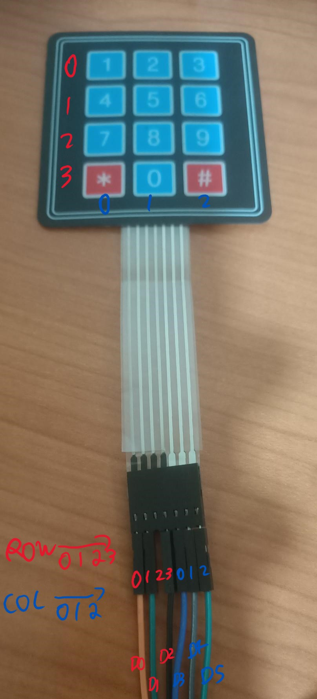
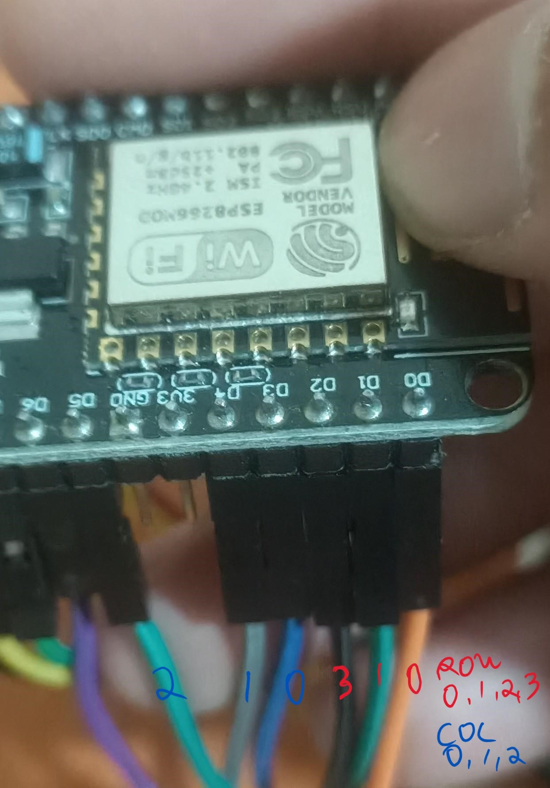
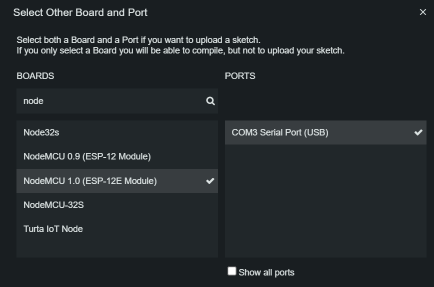
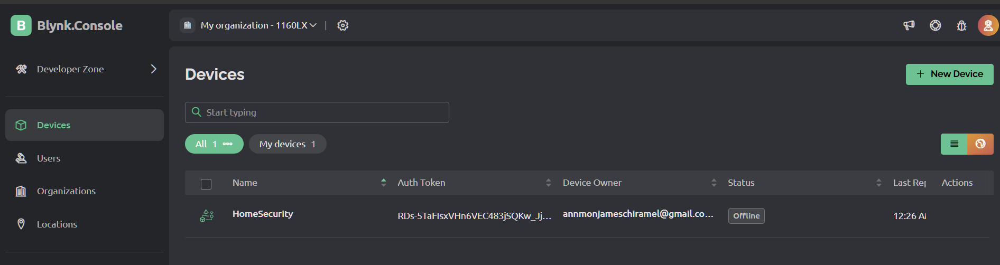
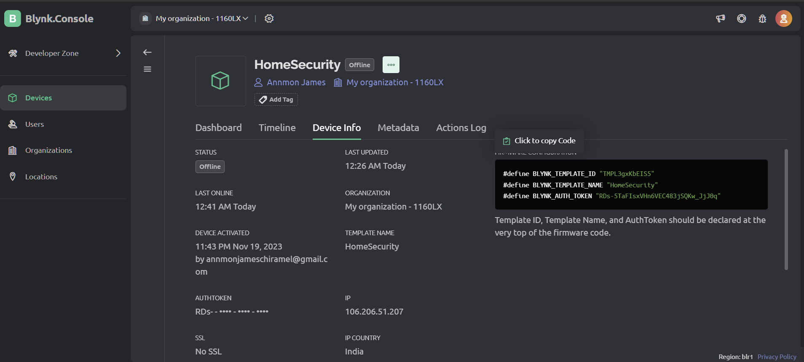
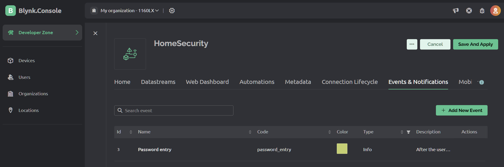
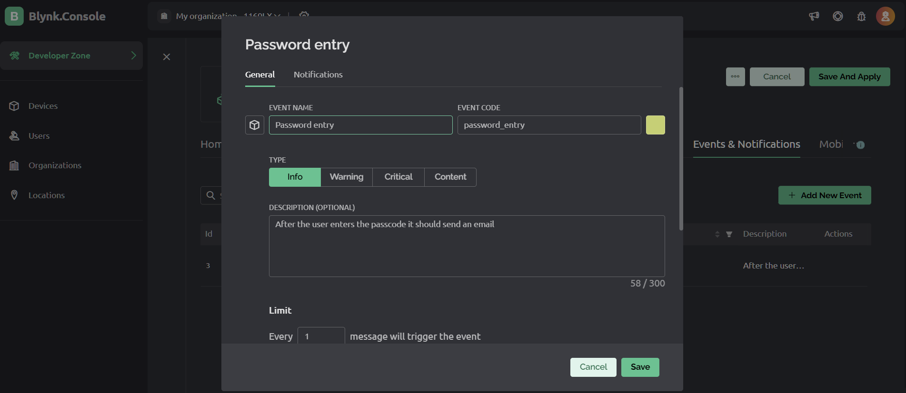
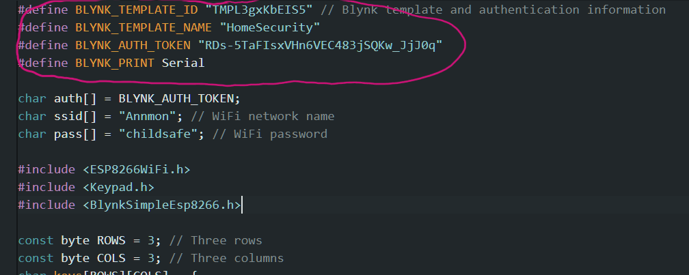
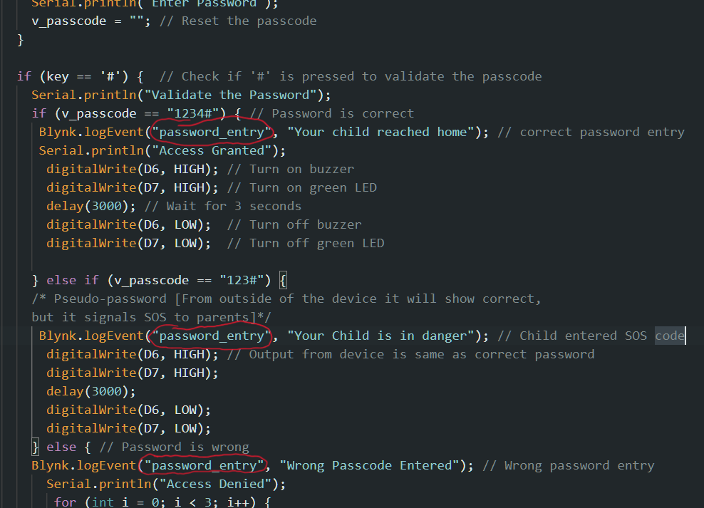

# Child_safety_gadget_HomeSecurity
Child safety gadget is a home security device which ensures the safety of the child when the child reaches home by providing acknowledgement to the parents who are not at home. There are three versions of this module, 
> child safety gadget 1.0 - The password mechanism module\
> child safety gadget 2.0 - The Camera module\
> child safety gadget 3.0 - The lock module

## Child safety gadget 1.0
Child safety gadget 1.0 is a device, to provide acknowledgement to parents through email to notify that child reached home after the child enters correct password on the keypad, and the led will blink green light and an email will be sent to parents mobile. If the password is wrong, wrong passcode entered email will be sent and red led will blink. The child can enter a pseudo-passcode which is a different password if the child feels threatened and this will send an SOS email to parents but the device will blink green light to fool the criminal to believe that the child entered the correct passcode. 
The components of project are ES8266 microcontroller, Keypad, RGB Led light, Jumper wires. IoT platform Blynk 2.0 is also used. 

## Child safety gadget 2.0
Child safety gadget 2.0, brings camera feature to the device where it will take a picture and sends the picture to Google drive when someone comes near the device. An IR sensor is used for this, as the child enters the password the IR sensor which is placed near the device will get activated and will send the picture to parents Google drive. 
The components used in this project are ESP32CAM, IR sensor, FTDI232 (only while uploading the code), Jumper wires and Breadboard.

# Development steps for child safety 1.0

### How to Connect wires between Keypad & ESP8266
ROW0-->D0, ROW1-->D1, ROW2-->NOT USED, ROW3-->D2
COL0-->D3, COL1-->D4, COL4-->D5
THE KEYPAD IMAGE

THE MICROCONTROLLER IMAGE [ESP8266-NodeMCU]

### Selection of Board in Arduino IDE
Select the board and then upload the code, once code is written.

If you completed testing the code for keypad, then NEXT STEP is configuring email using Blynk IoT platform to send emails to parents email id.

### Setting up Blynk (Main things to consider)

Creating a template

Click on "Click to copy Code", which will copy Template ID, Template Name, and AuthToken, and later you have to paste it in the code file

Go to "Events & Notification tab", and then click on "Add New Event", Since we are using IoT for sending emails

Enter "Event Name" and then click "Save"

The code snippet that you copied before can be pasted here (Circled Red)

Don't forget to the automatically generated "Event code" in the code file, This will activate the specific IoT functionality to trigger. 
