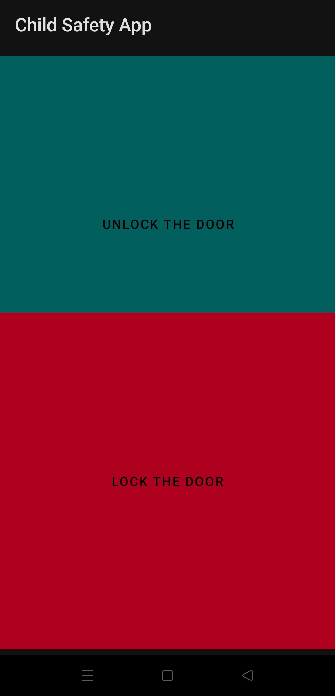

# Child_safety_gadget_HomeSecurity
Child safety gadget is a home security device which ensures the safety of the child when the child reaches home by providing acknowledgement to the parents who are not at home. 
 
The novel element of this project is the "PSEUDO-PASSCODE" concept, where the perpetrator will not able to find whether the child entered correct or incorrect password, which will alert the parents. There are five versions of this module, 
> child safety gadget 1.0 - The password mechanism module\
> child safety gadget 2.0 - The Camera module\
> child safety gadget 3.0 - The lock module\
> child safety gadget 4.0 - The dedicated mobile app\
> child safety gadget 5.0 - Extra features and future expansion

The Child Safety Gadget is an innovative project designed to enhance home security and child safety. It features a pseudo-passcode system for emergency situations, enabling discreet alerts to parents. Version 1.0 is budget-friendly, making it accessible for broader communities, including rural areas. The gadget evolves through versions, adding functionalities like a camera in 2.0 for visual confirmation, and a mobile app in 4.0 for remote access and viewing captured images. Version 5.0 introduces an I/O expander and additional sensors, further broadening the system's capabilities. The project addresses various scenarios, including forgetting passcodes and handling potential abductions, emphasizing quick parent response and the importance of security education for children.

## Child safety gadget 1.0
Child safety gadget 1.0 is a device, to provide acknowledgement to parents through email to notify that child reached home after the child enters correct password on the keypad, and the led will blink green light and an email will be sent to parents mobile. If the password is wrong, wrong passcode entered email will be sent and red led will blink. The child can enter a pseudo-passcode which is a different password if the child feels threatened and this will send an SOS email to parents but the device will blink green light to fool the criminal to believe that the child entered the correct passcode. And a unique notification sound will played in parents mobile only for those emails coming from gadget. \
The components of project are ES8266 microcontroller (C++ programming language), Keypad, RGB Led light, Breadboard, Jumper wires. IoT platform Blynk 2.0 is also used. 

## Child safety gadget 2.0
Child safety gadget 2.0, brings camera feature to the device where it will take a picture and sends the picture to Google drive when someone comes near the device. An IR sensor is used for this, as the child enters the password the IR sensor which is placed near the device will get activated and will send the picture to parents Google drive. \
The components used in this project are ESP32CAM (C++ and C programming language), IR sensor, FTDI232 (only while uploading the code), Jumper wires, Breadboard, Gdrive (JavaScript programming language)
## Child safety gadget 3.0
Child safety 3.0, Door lock is added to the existing child safety gadget, which makes part of Home Security. 
Door will be opened if either correct password OR pseudo-password is entered, To lock the door another password can be entered. For wrong password, nothing will happen. \
Components used in this project are 5 Volt 1-channel relay, Solenoid lock, 12 Volt adapter, Jumper wires. 

## child safety gadget 4.0 
Child safety 4.0, Created a simple dedicated mobile app for this hardware oriented project, Now the user can lock or unlock the door using mobile app which would be userful if the keypad got damaged in rare cases. Also in the mobile app, Users now can see the pictures received in the Google drive through the mobile app. 
Using the IP address of this NodeMCU (ESP8266), was able to successfully integrate the mobile app with the hardware for door lock. For the Google drive, the folder's shared link which contains the captured images is added to the app, so the user can access it through the mobile app. 
Components used in this project are Android Studio IDE (Java programming language, SQLite, XML markup language). 

## child safety gadget 5.0
Child safety 5.0, since the Input/Output pins of the ESP8266 microcontroller are used up, an Input/Output expander called PCF8574 is introduced, now this project can be expanded for home security be adding extra features for the future. Currently, OLED display, flame sensor, buzzer are added. Now, the old keypad 4×3 is replaced with the new 4×4 keypad. And the new 4×4 keypad is connected to input pins of PCF8574 and not to the micrcontroller, which frees the I/O pins in the microcontroleer.  Here, OLED display is used to display the message to the person interacting with the device, this is important as earlier only LED was used to indicate the message whether password is correct or wrong. \
Forget Password through hardware \
Thanks to OLED display, now it will be possible for the user to change the password if the user forgets. As the user can see the steps through OLED display to complete the procedures for changing password. If the user press 'C' in the keypad then a randomly generated number called OTP(One Time password) will be sent to user's email id. After the user enters the OTP, then the user is allowed to change the password for three passwords at a time. a. For correct password b. For Pseudo-password c. To lock the door.  \
Buzzer will also give indication whether password is correct or not like RGB LED. And flame sensor is user where flame sensor will detect and send an email, if the house is on fire. \
Components used in this project are PCF8574, 4×4 keypad, OLED display, flame sensor, Buzzer.

## Hardware components used
#### Boards 
1. ESP8266 microcontroller (The brain of the Project except camera project)
2. ESP32Cam microcontroller (The brain of the only Camera project)
#### Inputs
3. 4*4 keypad (Where user interact with the device to enter password)
4. Flame sensor (Detects fire)
5. IR sensor (Detects user presence near the keypad and will send pictures after detection)
#### Outputs
6. OLED display (To display the message so that the user can see)
7. RGB Led (Indication based on password entry:- GREEN=Correct; RED=Incorrect)
8. Buzzer (Indication based on password entry:- LONG BEEP=Correct; SHORT FREQUENT BEEP=Incorrect)
#### Other ICs
9. PCF8574 (An Input/Output expander which overcomes the limited I/O pins in ESP8266)
10. LM7805 (Voltage regulator that takes 12 Volts as inputs and converts to 5 volts)
#### Miscellaneous
11. 5 Volt 1-channel relay (For solenoid lock)
12. Solenoid lock (To lock or unlock the door)
13. 12 Volt adapter (Power source for the entire project)
14. Breadboard (For Beginner's level prototyping to facilitate connections)
15. Jumperwires (For Beginner's level prototyping to connect components)
16. FTDI232 (Only while flashing the code to ESP32CAM)

## Software components used
17. Blynk 2.0 (For sending emails)
18. Android Studio (For mobile app- Door lock and to view Captured images)
19. Gmail (To check emails)
20. Gdrive (For storing images)

# Development steps for child safety 1.0

### How to Connect wires between Keypad & ESP8266
ROW0-->D0 \
ROW1-->D1 \
ROW2-->NOT USED \
ROW3-->D2 \
COL0-->D3 \
COL1-->D4 \
COL4-->D5 

THE KEYPAD IMAGE

THE MICROCONTROLLER IMAGE [ESP8266-NodeMCU]

### Selection of Board in Arduino IDE
Select the board and then upload the code, once code is written.

If you completed testing the code for keypad, then NEXT STEP is configuring email using Blynk IoT platform to send emails to parents email id.

### Setting up RGB LED
 \
In this picture, 'R'=Red light, 'G'=Green light, 'B'=Blue light and (+) should be connected to the Ground 
#### RGB LED <--> ESP8266 
G  <--> D7 \
R  <--> D8 \
'+'<--> GND 

### Setting up Blynk (Main things to consider)

Creating a template

Click on "Click to copy Code", which will copy Template ID, Template Name, and AuthToken, and later you have to paste it in the code file

Go to "Events & Notification tab", and then click on "Add New Event", Since we are using IoT for sending emails

Enter "Event Name" and then click "Save"

The code snippet that you copied before can be pasted here (Circled Red)

Don't forget to add the automatically generated "Event code" in the code file, This will activate the specific IoT functionality to trigger. (Circled Red)

### Setting up notification sound for only for the emails from this device
To set a specific ringtone for emails coming from a particular email ID in Gmail, you would generally need to use a combination of Gmail's filtering features and your mobile device's notification settings. Gmail itself does not directly support setting custom ringtones for specific email addresses, but you can achieve a similar effect by creating a filter to label emails from the specific sender and then adjusting your phone's notification settings for Gmail to only notify you for emails with that label. Here's a general approach:

### Step 1: Create a Filter in Gmail for the Specific Email ID

1. **Open Gmail:** Log in to your Gmail account on a computer.
2. **Search for the Email:** Use the search bar at the top to search for emails from the specific email address.
3. **Create a Filter:** Click on the small arrow on the right side of the search bar to open the advanced search box. Enter the specific email address in the "From" field. Then, click on "Create filter" at the bottom of the search window.
4. **Choose Filter Actions:** Select "Apply the label" and choose a new label (you might need to create a new one specifically for this purpose, e.g., "Important Sender"). You can also choose other actions, but applying a label is crucial for this purpose. Click "Create filter" to finalize.

### Step 2: Adjust Notification Settings on Your Mobile Device

1. Open Gmail: Log in to your Gmail account on a computer.
2. Search for the Email: Use the search bar at the top to search for emails from the specific email address.
3. Create a Filter: Click on the small arrow on the right side of the search bar to open the advanced search box. Enter the specific email address in the "From" field. Then, click on "Create filter" at the bottom of the search window.
4. Choose Filter Actions: Select "Apply the label" and choose a new label (you might need to create a new one specifically for this purpose, e.g., "Important Sender"). You can also choose other actions, but applying a label is crucial for this purpose. Click "Create filter" to finalize.
For Android:
1. **Open Gmail App:** Go to your Gmail app.
2. **Go to Settings:** Tap on the menu (three horizontal lines), scroll down, and select "Settings."
3. **Select Your Account:** Choose the email account you've applied the filter to.
4. **Manage Labels:** Find and tap on "Manage labels" and then select the label you created for the specific sender.
5. **Adjust Notifications:** You can set custom notifications for this label, including the ringtone. Ensure that notifications are enabled for this label.

References
1. https://github.com/Tech-Trends-Shameer/Esp-8266-Projects/blob/main/Theft-Alert-Notification-Using-Blynk-IOT/theft-alert-notification-using-blynk-iot-and-esp8266.ino To know how the codng part for Blynk IoT works

# Development steps for child safety 2.0

### Setting up Google App Script

Click on "Start Scripting"

Click on "New Project"

Copy the JavaScript code and paste it there, you will get the code from "Google_appscript.js" file inside "Photo_ESP32Cam" folder 

Name your project by changing "Untitled Project" and then click on Deploy button and select "New deployment"

Select Web app

Select Anyone and then click Deploy

Then click Authorize access, again select your Google account, then click Advanced, then click "Go to ESP32CAM (unsafe)".
A new window will come- "ESP32CAM wants to access your Google account" so click Allow
[WARNING!], do not use your personal Google account, because it may access your personal data so use a dedicated Google account for it.

Copy the URL of the web app and paste it in the address bar and search.

Copy a part of the URL of the web app and paste it for the String variable myScript
For example, here the value of myScript after pasting should be:-
myScript= "/macros/s/AKfycbxcnqrleZjKohDYYwADWckLugt1Mr_sh-IAEcWw7TScxDNLexU/exec"

And then upload the code, before uploading you should now how to make connect ESP32CAM to FTDI programmer so learn how to do from below heading "Connection of ESP32CAM and FTDI programmer" \

#### Connection set up of IR sensor <--> ESP32CAM 
OUT <--> IO13 (Can be connected to any I/O pin of ESP32CAM) \
VCC <--> VCC \
GND <--> GND 

### Connection of ESP32CAM and FTDI programmer

While uploading the code, make sure GND and IO0 pins are connected in the ESP32-CAM microcontroller. After uploading the code, remove the connection between GND and IO0

In Arduino IDE, Go to Tools > Board and select ESP32 Wrover Module then upload the code. (After uploading, don't forget to remove that wire)

When you start to see some dots on the debugging window, press the ESP32-CAM on-board RST button.

After the code is uploaded and pressing reset button, place an object near IR sensor. And it will send images to Google drive. (You may have to wait for some time, there may be some lag and make sure adequate internet speed is there)
The pictures can be viewvew in Google drive's ESP32-CAM folder

After flashing the code to ESP32CAM using FTDI programmer, you can also give power without the need of FTDI Programmer, for that you can give power through 5 Volt power adapter, by connecting 5V pin of the ESP32CAM to the + ve terminal and GND pin of the ESP32CAM to the negative terminal.
>Troubleshooting
1. Sometimes, you need to think out of the box, you may think the error can be due to wrong code or setting up hardware improperly, I worked if for a while and finally replaced JUMPER WIRES, then it worked, even small things will have impact on your project. 
2. Use different cable for connecting between FTDI and USB port.
3. The camera in the ESP32-CAM may be loosely attached, so make sure that the camera is working, you may try with basic CameraWebServer code to check only for the camera.
4. Maybe you need to press RST button again, to check whether the ESP32-CAM works properly, in the one i brought, the ESP32-CAM blynks flash light after pressing RST button. (may not be true for all versions). I used ESP32-S version.

References- 

1. https://www.electroniclinic.com/esp32-cam-send-images-to-google-drive-iot-security-camera/ 
This is the main reference where i got the source code for the camera module. There are two files of source codes, one is without IR sensor(periodically taking pictures) and the other is with IR sensor. (Take picture when IR sensor gets activated)
2. https://randomnerdtutorials.com/program-upload-code-esp32-cam/ If you have doubts regarding connection of ESP32CAM and FTDI232 and on trouble shooting, then refer this
3. https://youtu.be/9BOYOMEJXUg
Watch this YouTube video, which will give the entire procedure 

# Development steps for child safety 3.0

Extra components required:- 1 channel relay, Solenoid lock, Power adapter.

Wiring connection of 1 channel relay \
NO (Normally Open) -->Solenoid lock's +ve terminal \
COM (Common)--> Power supply adapter's +ve terminal \
NC (Normally Closed) --> Left unconnected \
INP --> D6 of ESP8266 microcontroller \
V+ --> 3V3 of ESP8266 microcontroller \
GND --> GND of ESP8266 microcontrller \

Relay to ESP8266: \
INP (Input): Connected to pin D6 of the ESP8266. This pin controls the relay, and thereby the solenoid lock. \
V+: Connected to the 3V3 (3.3 volts) pin of the ESP8266. This supplies power to the relay. \
GND (Ground): Connected to a GND pin on the ESP8266 to complete the circuit. \

Relay to Solenoid Lock: \
NO (Normally Open): Connected to positive terminal of the solenoid lock. \
COM (Common): Connected to the positive (+) terminal of the 12V power supply. The negative terminal of the solenoid lock connects to the negative (-) terminal of the power supply. \

My observation:- 
If you connect COM of relay channel to the positive terminal of the 12V power supply then you must connect negative terminal of the solenoid lock to the negative terminal of the 12 Volt \
-OR-
If you connect COM of relay channel to the negative terminal of the 12V power supply then you must connect negative terminal of the solenoid lock to the positive terminal of the 12 Volt \

1-Channel Relay: Serves as an electrically operated switch that allows the ESP8266 to control the solenoid lock, which operates at a higher voltage than the ESP8266 can handle directly.

One pin of solenoid lock is connected to the power supply adapter and the other pin is connected to NO (Normally Open) of Solenoid lock \
Solenoid Lock: The locking mechanism that is controlled by the relay.

The end of wire of the Power supply adapter is cut, and we will get two wires, connect one end of the wire to the COM (Common) of the 1 channel relay and the other end to the Solenoid lock.

Why Connect to NO (Normally Open) and not NC (Normally Closed) of 1 channel relay ? \
Answer:- In a relay, the NO terminal represents a contact that remains open (i.e., no electrical connection) when the relay is not energized. When the relay coil is activated (energized), the contact closes, allowing current to flow through. \
In this Project, The NO terminal is connected to the solenoid lock. When the relay is not energized (i.e., when the ESP8266 has not sent a signal to trigger the relay), there's no electrical connection between the NO terminal and the COM terminal. This means the solenoid lock remains locked. When the correct passcode is entered, the relay is energized, closing the NO contact, allowing current to flow from the power source (12V adapter) through the COM and NO terminals to the solenoid lock, thus unlocking it.
COM (Common) is the common terminal used in both NO and NC configurations. It's the terminal to which you connect the power supply that you want to switch on or off. \
In this Project, the COM terminal is connected to the positive terminal of your 12V power adapter. Depending on the state of the relay (energized or not), this terminal either makes or breaks the circuit with the NO terminal, thus controlling the locking or unlocking of the solenoid.
NC (Normally Closed) terminal is the opposite of NO. It represents a contact that is closed (i.e., there is an electrical connection) when the relay is not energized. When the relay is activated, this contact opens, breaking the current flow. \
In this Project: Haven't used the NC terminal in this setup. If it were used, the solenoid lock would be unlocked by default and would only lock when the relay was energized.

# Development steps for child safety 4.0

In child safety 4.0, Android mobile app is integrated with the existing hardware module. \
To develop android app, Java programming language and XML embedded language is used.
The purpose of the Android mobile app is for two main reasons:- a. Child safety 2.0 uses Google drive to store captured images. And the captured images are stored in a particular folder among many if other folders are there in one's Google drive app. It will be difficult for the user to find the particular folder which contains all the images captured by the device and for that a dedicated mobile app is built. In this app, the user can click on captured images button to view all images by the gadget. This app only shows that particular folder's images. b. Child safety 3.0 uses door lock mechanism. There can be very rare cases that the hardware especially the keypad get damaged if the user uses it for long time like after pressing keys for many times on regular basis. And access to the door is very important for the user, and for the safety and as an alternative option the user can lock or unlock the mobile app using this Android app. \
Softwares used:- Android Studio (Java and XML)

There are three main parts here, first we have to interface Hardware with Mobile app, so for that we will start with a simple LED to test, later we will replace with door lock so that the user can lock or unlock the door using mobile app and let's called that page "Operating page". Secondly, we will create a login and account creation pages with database using SQL, this will ensure that the user can operate in the operating page after user login. Third step is to integrate the Google drive folder which has captured images in the mobile app. 

How to use? \
The user first should create a account, then login to the mobile app, if the login successful, then it will navigate to "Home Page", in home page there are two buttons, one is door lock and the the other is captured images. To control the door lock, go to the door lock button and it see images go to Captured images button. 

Find the IP address of the ESP8266.
To find the IP address, you may use this code file given in the above link in the reference 4.3 and then run it in ESP8266

Change to the IP addess of your ESP8266. For that download the You_Tube_WIFI_APP from the link given in the reference 4.1. Since this is the beginning, start this using simple LED to check whether the interface with the hardware and mobile app is working. If it worked, then you move onto next procedure to set up the mobile app's login and account creation. 

 \
Change from this (LED page) ---> To this (Door lock page)

To integrate login & account creation pages
In AndroidManifest.xml, change the .MainActivity exported as false and rename the file name if needed. 
android:exported="true" is for the page that comes first when the app is opened. In this case, .LoginActivity is the page which should be set like this.
For account basic user login process, it should have these files:-
LoginActivity.java and it's corresponding xml file
RegisterActivity.java and it's corresponding xml file
Database.java for storing datas
HomeActivity.java and it's corresponding xml file, this page is created for later use, currently it's an empty page where the user will navigate to this page after successful login. Later we will add buttons for this page, can be used as a home page for the user. 

    

Login page | Register page | Home page | Door lock page | Google drive page 

Check out the reference 4.4 (YouTube video) and 4.5 (GitHub repository) to learn on how to set up basic user login and account creation
Basic things to consider while making login set up for the app are:-
1. OnClickListener:- OnClickListener is an interface in Android development that defines a callback to be invoked when a view (such as a button, text field, etc.) is clicked. When you set an OnClickListener on a view, you are telling Android what to do when that view is clicked.
here, Getting the text from edUsername and edPassword, presumably EditText fields, and storing them in the username and password strings.
Displaying a Toast message that says "Login Success". When you set this listener on a button using btn.setOnClickListener(...), it makes the button respond to click events by executing the code you've written in the onClick method. This pattern is widely used in Android for handling user interface events.
2. Intent:- To navigate from one page to another.  
Here,  startActivity(new Intent(LoginActivity.this, RegisterActivity.class)); creates an intent to navigate from LoginActivity to RegisterActivity, and then starts RegisterActivity.
3. Cursor:- Cursor is an interface that provides random read-write access to the result set returned by a database query. The primary purpose of a Cursor is to facilitate the traversal and reading of database query results. It acts as a pointer that moves over the rows of the result set, allowing you to access data from each column of the currently pointed-to row. 
4. SharedPreferences:- now the code not only checks the login credentials but also saves the successful login's username to SharedPreferences so that you can access it later in other parts of your application.

After integrating login & account creation for the app, let's move onto Home page to add buttons. Add Door lock button so the user can navigate to the operating page to lock or unlock the door using Android Studio IDE. In hardware part for the app, change the code accordinly to make the door lock works instead of LED using Arduino IDE. 
Using Arduino IDE, you have to mix the existing code of email setup using Blynk and Solenoid lock code with the LED using app hardware code. 

Let's go to create next button for Google drive integration with the mobile app. For that you have to set user permission in AndroidManifest.xml and also set the URL of the google drive's particular folder using Adnroid Studio. 

References \
4.1 https://youtu.be/8gGgsMe5dKQ?list=PLcDb_G2hdBvaPMKPxnzjV6WSQKCYFU15N \
4.2 https://github.com/Javlon3002/twoWayCommunicaitonAndroidAPP \
4.3 https://github.com/annmonrajijames/Child_safety_gadget_HomeSecurity/tree/73344bc82aef18c751c09d72e95cf02de5922d5d/Mobile_app/HardwareSetup/IpAddress_Wifi_hotspot \
4.4 https://youtu.be/9CkpMm-n5iA \
4.5 https://github.com/annmonrajijames/Healthcare_Practice

# Development steps for child safety 5.0
In child safety 5.0, the project has set up in a way for future expansion to more Home Security components like Sensors, displays etc. The challenge of limited input/output pins of the ESP8266 has overcame by introducing an Input/Output expander IC called PCF8574. \
Thanks to PCF8574, this project now was able to add more components like OLED display, Buzzer, Flame Sensor and also was able to replace previous 4×3 keypad with 4×4 keypad. \
In this project, 4×4 keypad is interfaced with PCF8574 's input/output pins. \
Connection set up of 4×4 keypad <--> PCF8574 \
P0 <--> ROW0 \
P1 <--> ROW1 \
P2 <--> ROW2 \
P3 <--> ROW3 \
P4 <--> COL1 \
P5 <--> COL2 \
P6 <--> COL3 \
P7 <--> COL4 \

Connection set up of OLED display <--> ESP8266 \
SCL <--> SCL \
SDA <--> SDA \
VCC <--> VCC \
GND <--> GND \
 
In ESP8266, pins D1=SCL and D2=SDA. 
What is I2C here ? \
I2C (Inter-Integrated Circuit) is a communication protocol used to connect low-speed devices like microcontrollers, sensors, and displays in a two-wire interface (SDA for data and SCL for clock). It allows multiple devices to be connected to the same bus, enabling communication with each device through unique addresses, making it efficient for managing multiple peripherals with minimal wiring.

Flame Sensor interface with ESP8266 \
VCC <--> VCC \
GND <--> GND \
D0  <--> D0 (can connect to any I/O pins of ESP8266) \

Buzzer interface with ESP8266 \
Longer pin (+ve pin or anode)    <--> D6 (can connect to any I/O pins of ESP8266) \
Shorter pin (-ve pin or cathode) <--> GND

References \
5.1 https://youtu.be/tGfPhHPaHQo \
5.2 https://drive.google.com/drive/folders/1MTmzQXJQrrw97AING47bJaT2kvvm8maH

# Power Supply
LM7805 Voltage regulator is used because in this project, we will only use one 12 volt adapter. 12 Volt power supply is required for Solenoid lock and 5 Volt supply is required for microcontrollers and other components. If the power supply given to the microcontroller is 12 Volts then the microcontroller will get damaged so to avoid this issue LM7805 voltage regulator can be used. \
### Setting up Power supply
 \
LM7805 has three pins. If it's front side is faced, then the left end terminal will accept 12 Volt as input and the right end terminal will give 5 Volt as output. The middle terminal is the ground. \

# The "CHILD SAFETY GADGET WITH HOME SECURITY" project

# Cost of the Project
Total cost of the project including GST if brought from Robu website on 10 Mar 2024 (In Indian Rupees):- 
https://robu.in/?gad_source=1&gclid=CjwKCAiA0bWvBhBjEiwAtEsoW9uGRmDiWHRcDfuzo-PrXZKL_B0HSjVdkSTv8rngaPaSNuCAQnRvTxoCAGsQAvD_BwE 

#### Child safety 1.0  
ESP8266 - Rs.175 \
Keypad - Rs.56 \
RGB LED - Rs.9 \
Breadboard - Rs.76 \
Jumper wires (Male to Male (20cm, 40 pcs)) - Rs. 39 \
Jumper wires (Male to Female (20cm, 40 pcs)) - Rs. 40 \
Jumper wires (Male to Female (30cm, 40 pcs)) - Rs. 39 \
Blynk 2.0 IoT - Rs.0 (limit-100 emails per day) \
Total = Rs. 434
#### Child safety 2.0  
ESP32CAM - Rs.518.02 (not available in Robu website, so price in electronicscomp website https://www.electronicscomp.com/esp32-cam-wifi-module-bluetooth-with-ov2640-camera-module-2mp-for-face-recognization?gad_source=1&gclid=CjwKCAiA0bWvBhBjEiwAtEsoW0LWGZ-wSrWTTinmLhoZ0bD5nEJEe0WZsbRmDKPfwmObaSN3bfwnUBoCs2IQAvD_BwE) \
IR sensor - Rs.26 \
FTDI Rs.319 (Only while flashing the code is required, you can also use Arduino module) \
Breadboard - Rs.76 \
Total = Rs.939.02
#### Child safety 3.0
5V 1 Channel Relay - Rs.39 \
12V DC Solendoid lock - Rs.330 \
12v Adapter - Rs.429 \
Total = Rs.798

#### Child safety 4.0
Mobile app - Rs.0 \
Total = Rs.0
#### Child safety 5.0
PCF8574 - Rs.75 \
4*4 Keypad - Rs.42 \
OLED Display - Rs.175 \
Flame Sensor - Rs.32 \
Buzzer - Rs.55 \
Total = Rs.379

#### Power supply
From Electronicscomp website:- https://www.electronicscomp.com/lm7805-ic?gad_source=4&gclid=CjwKCAiA0bWvBhBjEiwAtEsoW-IdgHvwYvrIZVsRr5aox5FIahhXebEqh33nH8GO_i_g8AYojChltBoCE-oQAvD_BwE \
LM7805 - Rs.9 \
LM7805 - Rs.9 \
Total = Rs.18
#### Total cost of the whole project = *Rs.2,568.02*
FTDI 232 component won't be used in the project after completion of the project so in that case the cost of the project would be 2,550.02-319= *Rs.2,249.02*

# FAQs to this project's idea
1. What makes this child safety gadget innovative? \
The gadget introduces a novel pseudo passcode feature and timely parent notifications, making it an affordable solution for ensuring children's safety, so the Pseudo passcode concept with the acknowledgement whether child reached home on time and it is CHEAP.

2. How does the pseudo passcode work? \
If under threat, a child can enter a pseudo passcode. Externally, the system acts as if the correct code was entered, but it discreetly sends an SOS email to the parents. \
Which means, Outside, the device will displays correct password as if the passcode entered is correct, but it will send an SOS email to parents. This is used when the child gets forced by the perpetrator. 

3. What if a criminal abducts the child after they've safely entered the home? \
While the gadget cannot prevent post-entry abductions, it offers early alerts, enabling quicker parental response, potentially before they're aware of any issue. \
Let's elobrate- this device primarily enhances safety by alerting parents when their child arrives home and enabling an SOS feature under duress. While it doesn't prevent abduction scenarios after the child's safe arrival, it serves as an early alert system, providing crucial information for parents to act swiftly. Its main purpose is to monitor and communicate a child's safety status upon arriving home. Also camera may give some evidences related to the abductor. This device is all about the time gap, and the chance for the parents to ACT QUICKLY and won't help the child to save from abduction. \
For instance, parents may reach their home late maybe around 7-8 PM, whereas the child reaches home from school around 4 PM so if the parents came to know their child got kidnapped when they arrived, it is more dangerous and less hope because it's being hours since the child got kidnapped. But if this device is there, the parents will know that their child got kidnapped or not reached home within minutes as they know the child should reach home around 4 PM. 

4. What happens if a child forgets the passcode? \
Forgetting the passcode is rare due to habitual use. However, protocols involving neighbors or parental intervention ensure security without compromising the system's reliability. \
The daily routine and capabilities of school-going children can rarely makes the child forget password. Establishing a protocol for rare instances, like forgetting the passcode, involving neighbors or immediate contact by parents, ensures a balance between independence for the child and safety measures. This proactive planning enhances the system's reliability and user trust.

5. What if criminal forces the child to enter correct password to fool parent ? \
The pseudo passcode and potential camera evidence are designed to counteract such scenarios, alerting parents without revealing the child's distress.

6. Where is the Camera located? \
Camera is placed in a way, that the child interacting with the device can be seen.

7. How camera is activated? \
An IR sensor is placed near or in the keypad so it will take picture when child enters the passcode.

8. How to reset passcode? \
Press C in the keypad, then an OTP will be sent to email, enter the OTP in the keypad, if the OTP is correct, then the user can set new password for three cases- 1. Correct password; 2. Pseudo-password; 3. To lock the door - Where they should lock house after leaving the house. 

9. What if Internet is not there? \
In Blynk app, you will see OFFLINE or ONLINE.

10. Why mobile app? \
A. Locking and unlocking the door can be also done using the app, what if the keypad got damaged, there can be rare cases where the hardware like keypad may get damaged after using the keypad for very longer time, and access to open the door is necessary for the owner whenever he/she wants. \
B. Integrated Google drive's particular folder in the app, it is difficult to find the particular folder to see the captured images as in a typical Google drive there can be many folders, this app will only show that particular folder's content through the app which will make the user access easy. 

11. Why not video instead of picture? \
Because, As parents, they only need the snap of the child instead of the full video, full video can be difficult for the parent to find the timeline of the video. Also it will save data storage.

12. What about GPS based tracking? \
Battery requirement, not reliable because it can be damaged easily when it is in Kids hand. Perpetrator can find other ways to overcome it like he can fool by sticking behind the bus etc. This child safety gadget device ensures child reached home safely on time. 

13. Can the child use a phone instead? \
It is impractical to call or text every single day at that time (eg. 4:00PM), hard to do, maybe they forget, what if low battery in mobile. And parents won't trust mobile in kids hands. 

14. If there is camera then what is the use of this project? \
The gadget's value is in its immediate alert system and the pseudo passcode feature, offering solutions where cameras might not provide complete coverage or in affordability-sensitive contexts. \
Imagine, when the perpetrator is there with the child, and the perpetrators forces the child to enter the correct password to make the front door open so to make the child come out of the house after entering correct password, during this time the perpetrator made plan not to go near the door area of the house where there is camera. If the pseudo passcode is there, this problem will be solved. As the child can send secret message to parents. 
This project's child safety 1.0 version does not comes with camera and this makes it more cheap and affordable, especially to rural villages. As the child can be kidnapped from the back side of the door. So adding two cameras(front and back of house) will make it more expensive. \
Also the perpetrator, can out smart camera by entering from other side of the house where there is no camera by threatening the child to come outside. But if there is pseudo passcode concept then all these case scenarios can be solved. It promises the safety of the child.

15. What if there are two siblings, one child reaches around 4:00 PM and another child reaches around 5:00 PM, how would the parents know that their both children reached home safely? \
Relying on intra-family communication for comprehensive safety checks.
Don't need to make it complicated by adding different set of passcodes for another child. \
If the first child reaches home and interacted then it will send email to parents. The second child can enter the same passcode again, assuming the first child understands the importance of the device and safety and does not enter the same passcode again and again during the time when second child comes. Also the first child can contact parents immediately if the second child does not reaches home on that particular time. If the first child understands the reality and behave accoringly then this will not be an issue.

16. What happens to the door lock, when the child enters pseudo-passcode? \
The solenloid lock will unlock, which means the door will open. This way the perpetrator will never know whether the child deceived and the parents will recieve SOS email that the child is in danger so they can act quickly. 